# แผนที่ความสัมพันธ์กติกา SE ไทย (Knowledge Graph)

> **⚠️ คำเตือนความเป็นปัจจุบัน:** ข้อมูลตามเอกสารฉบับที่เก็บไว้ ณ วันที่ของแต่ละฉบับ (พ.ศ. 2562–2567) — กฎหมายมีการแก้ไข/เพิ่มเติมได้ ต้องตรวจสอบฉบับล่าสุดกับราชกิจจานุเบกษา (ratchakitcha.soc.go.th) และ สวส./OSEP (osep.or.th) ควบคู่กันก่อนดำเนินการทุกครั้ง

> ข้อมูลเชิงเครื่องอ่านได้อยู่ใน [kg.json](kg.json) (nodes + edges + keywords) — ไฟล์นี้คือมุมมองสำหรับคน

## ภาพรวม

```mermaid
flowchart TD
  ACT["พ.ร.บ.ส่งเสริมวิสาหกิจเพื่อสังคม พ.ศ. 2562<br/>(กฎหมายแม่ 89 มาตรา)"]
  subgraph A["กลุ่ม A — ผู้ประกอบการใช้โดยตรง"]
    gov_governance_2562["ธรรมาภิบาล 2562"]
    duration_2562["ระยะเวลาดำเนินกิจการ 2562"]
    app_items_2562["เอกสารประกอบคำขอ 2562"]
    app_form_2562["แบบฟอร์ม 2562"]
    profit_use_2562["กำไร 70% 2562"]
    group_notify_2563["กลุ่มกิจการเพื่อสังคม 2563"]
    cert_replace_2563["ใบแทน 2563"]
    change_reg_2563["เปลี่ยนประเภท 2563"]
    change_reg_no2_2564["เปลี่ยนประเภท 2564"]
    annual_report_2564["รายงานประจำปี 2564"]
    nonprofit_lowrev_2565["ไม่แบ่งปันกำไร 2565"]
    social_benefit_2565["SDGs 2565"]
  end
  subgraph B["กลุ่ม B — กองทุนส่งเสริม SE"]
    fund_expert_2563["ผู้ทรงคุณวุฒิ 2563"]
    fund_money_2564["เงินกองทุน 2564"]
    fund_loan_2565["กู้ยืม 2565"]
    fund_early_2565["เงินทุนระยะเริ่มแรก 2565"]
    fund_gov_help_2565["ส่วนราชการ 2565"]
    fund_subsidy_2565["อุดหนุน 2565"]
    fund_criteria_loan_2567["เกณฑ์ชี้วัด 2567"]
    fund_criteria_early_2567["เกณฑ์ชี้วัด 2567"]
    fund_criteria_gov_2567["เกณฑ์ชี้วัด 2567"]
    fund_donation_2567["บริจาค 2567"]
  end
  subgraph C["กลุ่ม C — บริหารภายใน สวส."]
    bylaw_persons_2562["บุคคล 2562"]
    osep_positions_2563["ตำแหน่ง 2563"]
    bylaw_finance_2563["การเงิน 2563"]
    overtime_2565["ค่าล่วงเวลา 2565"]
    bylaw_uniform_2563["เครื่องแบบ 2563"]
    bylaw_welfare_2563["สวัสดิการ 2563"]
    bylaw_travel_2564["ค่าเดินทาง 2564"]
    assembly_2564["สมัชชา 2564"]
    wages_2564["ค่าจ้าง 2564"]
    grievance_2565["ร้องทุกข์ 2565"]
    fees_2565["ค่าธรรมเนียม 2565"]
    asset_writeoff_2565["ทรัพย์สินสูญ 2565"]
    complaint_2565["ร้องเรียน 2565"]
    osep_structure["โครงสร้างองค์กร"]
    officials_appoint_2564["พนักงานเจ้าหน้าที่ 2564"]
    egov_system_2566["อิเล็กทรอนิกส์ 2566"]
    eservice_2566["ช่องทางอิเล็กทรอนิกส์ 2566"]
  end
  gov_governance_2562 --> ACT
  duration_2562 --> ACT
  app_items_2562 --> ACT
  app_form_2562 --> ACT
  profit_use_2562 --> ACT
  group_notify_2563 --> ACT
  cert_replace_2563 --> ACT
  change_reg_2563 --> ACT
  change_reg_no2_2564 --> ACT
  annual_report_2564 --> ACT
  nonprofit_lowrev_2565 --> ACT
  social_benefit_2565 --> ACT
  fund_expert_2563 --> ACT
  fund_money_2564 --> ACT
  fund_loan_2565 --> ACT
  fund_early_2565 --> ACT
  fund_gov_help_2565 --> ACT
  fund_subsidy_2565 --> ACT
  bylaw_persons_2562 --> ACT
  bylaw_finance_2563 --> ACT
  bylaw_uniform_2563 --> ACT
  bylaw_welfare_2563 --> ACT
  bylaw_travel_2564 --> ACT
  assembly_2564 --> ACT
  fees_2565 --> ACT
  asset_writeoff_2565 --> ACT
  complaint_2565 --> ACT
  officials_appoint_2564 --> ACT
  change_reg_no2_2564 -. amends .-> change_reg_2563
  fund_criteria_loan_2567 --> fund_loan_2565
  fund_criteria_early_2567 --> fund_early_2565
  fund_criteria_gov_2567 --> fund_gov_help_2565
  fund_donation_2567 --> fund_early_2565
  osep_positions_2563 --> bylaw_persons_2562
  overtime_2565 --> bylaw_persons_2562
  wages_2564 --> bylaw_persons_2562
  grievance_2565 --> bylaw_persons_2562
  egov_system_2566 -. related .-> ACT
  eservice_2566 -. related .-> ACT
  osep_structure -. related .-> ACT
```

## ความสัมพันธ์ (edges)

| จาก | ความสัมพันธ์ | ไปยัง | ฐาน |
|---|---|---|---|
| ประกาศคณะกรรมการส่งเสริมวิสาหกิจเพื่อสังคม เรื่อง การกำกับดู… | issued_under | พระราชบัญญัติส่งเสริมวิสาหกิจเพื่อสังคม พ.ศ. … | ม.5 วรรคหนึ่ง (4) + วรรคสอง |
| ประกาศคณะกรรมการส่งเสริมวิสาหกิจเพื่อสังคม เรื่อง ระยะเวลาดำ… | issued_under | พระราชบัญญัติส่งเสริมวิสาหกิจเพื่อสังคม พ.ศ. … | ม.7 (6) |
| ประกาศคณะกรรมการส่งเสริมวิสาหกิจเพื่อสังคม เรื่อง กำหนดรายกา… | issued_under | พระราชบัญญัติส่งเสริมวิสาหกิจเพื่อสังคม พ.ศ. … | ม.7 (8) |
| ประกาศสำนักงานส่งเสริมวิสาหกิจเพื่อสังคม เรื่อง แบบคำขอจดทะเ… | issued_under | พระราชบัญญัติส่งเสริมวิสาหกิจเพื่อสังคม พ.ศ. … | ม.7 |
| ประกาศคณะกรรมการส่งเสริมวิสาหกิจเพื่อสังคม เรื่อง เงื่อนไขกา… | issued_under | พระราชบัญญัติส่งเสริมวิสาหกิจเพื่อสังคม พ.ศ. … | ม.5 วรรคหนึ่ง (3) + วรรคสอง |
| ประกาศสำนักงานส่งเสริมวิสาหกิจเพื่อสังคม เรื่อง เงื่อนไขการจ… | issued_under | พระราชบัญญัติส่งเสริมวิสาหกิจเพื่อสังคม พ.ศ. … | ม.73 |
| ประกาศคณะกรรมการส่งเสริมวิสาหกิจเพื่อสังคม เรื่อง หลักเกณฑ์ … | issued_under | พระราชบัญญัติส่งเสริมวิสาหกิจเพื่อสังคม พ.ศ. … | ม.10 วรรคสอง + ม.19 (10) (จ) |
| ประกาศคณะกรรมการส่งเสริมวิสาหกิจเพื่อสังคม เรื่อง หลักเกณฑ์ … | issued_under | พระราชบัญญัติส่งเสริมวิสาหกิจเพื่อสังคม พ.ศ. … | ม.6 วรรคสอง + ม.8 วรรคสาม |
| ประกาศคณะกรรมการส่งเสริมวิสาหกิจเพื่อสังคม เรื่อง หลักเกณฑ์ … | issued_under | พระราชบัญญัติส่งเสริมวิสาหกิจเพื่อสังคม พ.ศ. … | ม.6 วรรคสอง + ม.8 วรรคสาม |
| ประกาศสำนักงานส่งเสริมวิสาหกิจเพื่อสังคม เรื่อง การจัดทำรายง… | issued_under | พระราชบัญญัติส่งเสริมวิสาหกิจเพื่อสังคม พ.ศ. … | ม.12 วรรคหนึ่ง |
| ประกาศคณะกรรมการส่งเสริมวิสาหกิจเพื่อสังคม เรื่อง การจดทะเบี… | issued_under | พระราชบัญญัติส่งเสริมวิสาหกิจเพื่อสังคม พ.ศ. … | ม.5 (2) + ม.19 (10) |
| ประกาศสำนักนายกรัฐมนตรี เรื่อง กำหนดลักษณะของกิจการที่มีวัตถ… | issued_under | พระราชบัญญัติส่งเสริมวิสาหกิจเพื่อสังคม พ.ศ. … | ม.4 + ม.5 (1) |
| ระเบียบคณะกรรมการส่งเสริมวิสาหกิจเพื่อสังคม ว่าด้วยการสรรหาผ… | issued_under | พระราชบัญญัติส่งเสริมวิสาหกิจเพื่อสังคม พ.ศ. … | ม.49 วรรคสอง |
| ระเบียบคณะกรรมการบริหารกองทุนส่งเสริมวิสาหกิจเพื่อสังคม ว่าด… | issued_under | พระราชบัญญัติส่งเสริมวิสาหกิจเพื่อสังคม พ.ศ. … | ม.51 (4) + วรรคสอง |
| ระเบียบคณะกรรมการบริหารกองทุนส่งเสริมวิสาหกิจเพื่อสังคม ว่าด… | issued_under | พระราชบัญญัติส่งเสริมวิสาหกิจเพื่อสังคม พ.ศ. … | ม.51 (3) + วรรคสอง (รองรับ ม.48 (1)) |
| ระเบียบคณะกรรมการบริหารกองทุนส่งเสริมวิสาหกิจเพื่อสังคม ว่าด… | issued_under | พระราชบัญญัติส่งเสริมวิสาหกิจเพื่อสังคม พ.ศ. … | ม.51 (3) + วรรคสอง (รองรับ ม.48 (2)) |
| ระเบียบคณะกรรมการบริหารกองทุนส่งเสริมวิสาหกิจเพื่อสังคม ว่าด… | issued_under | พระราชบัญญัติส่งเสริมวิสาหกิจเพื่อสังคม พ.ศ. … | ม.51 (3) + วรรคสอง (รองรับ ม.48 (3)) |
| ระเบียบคณะกรรมการบริหารกองทุนส่งเสริมวิสาหกิจเพื่อสังคม ว่าด… | issued_under | พระราชบัญญัติส่งเสริมวิสาหกิจเพื่อสังคม พ.ศ. … | ม.51 (3) + วรรคสอง (รองรับ ม.48 (4)) |
| ข้อบังคับคณะกรรมการส่งเสริมวิสาหกิจเพื่อสังคม ว่าด้วยการบริห… | issued_under | พระราชบัญญัติส่งเสริมวิสาหกิจเพื่อสังคม พ.ศ. … | ม.19 (10) (ก) |
| ข้อบังคับคณะกรรมการส่งเสริมวิสาหกิจเพื่อสังคม ว่าด้วยการเงิน… | issued_under | พระราชบัญญัติส่งเสริมวิสาหกิจเพื่อสังคม พ.ศ. … | ม.19 (10) (ก) + ม.28 วรรคสอง (เห็นชอบโดยกระทรวงการคลัง) |
| ข้อบังคับคณะกรรมการส่งเสริมวิสาหกิจเพื่อสังคม ว่าด้วยเครื่อง… | issued_under | พระราชบัญญัติส่งเสริมวิสาหกิจเพื่อสังคม พ.ศ. … | ม.19 (10) (ง) |
| ข้อบังคับคณะกรรมการส่งเสริมวิสาหกิจเพื่อสังคม ว่าด้วยการจัดส… | issued_under | พระราชบัญญัติส่งเสริมวิสาหกิจเพื่อสังคม พ.ศ. … | ม.19 (10) (ค) |
| ข้อบังคับคณะกรรมการส่งเสริมวิสาหกิจเพื่อสังคม ว่าด้วยค่าใช้จ… | issued_under | พระราชบัญญัติส่งเสริมวิสาหกิจเพื่อสังคม พ.ศ. … | ม.19 (10) (ก) + ม.28 วรรคสอง |
| ระเบียบคณะกรรมการส่งเสริมวิสาหกิจเพื่อสังคม ว่าด้วยการประชุม… | issued_under | พระราชบัญญัติส่งเสริมวิสาหกิจเพื่อสังคม พ.ศ. … | ม.75 วรรคสาม |
| ระเบียบคณะกรรมการส่งเสริมวิสาหกิจเพื่อสังคม ว่าด้วยการกำหนดห… | issued_under | พระราชบัญญัติส่งเสริมวิสาหกิจเพื่อสังคม พ.ศ. … | ม.19 (10) (จ) + ม.25 (6) |
| ระเบียบคณะกรรมการส่งเสริมวิสาหกิจเพื่อสังคม ว่าด้วยการจำหน่า… | issued_under | พระราชบัญญัติส่งเสริมวิสาหกิจเพื่อสังคม พ.ศ. … | ม.19 (10) (ก) |
| ระเบียบ เรื่อง การร้องเรียน พ.ศ. 2565… | issued_under | พระราชบัญญัติส่งเสริมวิสาหกิจเพื่อสังคม พ.ศ. … | ม.37 (3) |
| ประกาศสำนักนายกรัฐมนตรี เรื่อง แต่งตั้งพนักงานเจ้าหน้าที่เพื… | issued_under | พระราชบัญญัติส่งเสริมวิสาหกิจเพื่อสังคม พ.ศ. … | ม.4 |
| ประกาศคณะกรรมการส่งเสริมวิสาหกิจเพื่อสังคม เรื่อง หลักเกณฑ์ … | amends | ประกาศคณะกรรมการส่งเสริมวิสาหกิจเพื่อสังคม เร… | แก้ไขข้อ 8 |
| ประกาศคณะกรรมการบริหารกองทุนส่งเสริมวิสาหกิจเพื่อสังคม เรื่อ… | issued_under | ระเบียบคณะกรรมการบริหารกองทุนส่งเสริมวิสาหกิจ… | ข้อ 7 วรรคสอง |
| ประกาศคณะกรรมการบริหารกองทุนส่งเสริมวิสาหกิจเพื่อสังคม เรื่อ… | issued_under | ระเบียบคณะกรรมการบริหารกองทุนส่งเสริมวิสาหกิจ… | ข้อ 7 วรรคสอง |
| ประกาศคณะกรรมการบริหารกองทุนส่งเสริมวิสาหกิจเพื่อสังคม เรื่อ… | issued_under | ระเบียบคณะกรรมการบริหารกองทุนส่งเสริมวิสาหกิจ… | ข้อ 7 วรรคสอง |
| ประกาศคณะกรรมการบริหารกองทุนส่งเสริมวิสาหกิจเพื่อสังคม เรื่อ… | issued_under | ระเบียบคณะกรรมการบริหารกองทุนส่งเสริมวิสาหกิจ… | ข้อ 4 วรรคสอง |
| ประกาศสำนักงานส่งเสริมวิสาหกิจเพื่อสังคม เรื่อง การกำหนดตำแห… | issued_under | ข้อบังคับคณะกรรมการส่งเสริมวิสาหกิจเพื่อสังคม… | ข้อ 6/1 |
| ประกาศ เรื่อง ค่าล่วงเวลา (28 ม.ค. 2565)… | issued_under | ข้อบังคับคณะกรรมการส่งเสริมวิสาหกิจเพื่อสังคม… | ข้อ 31 (+ม.36 พ.ร.บ.) |
| ประกาศ เรื่อง ค่าจ้างของลูกจ้าง พ.ศ. 2564… | issued_under | ข้อบังคับคณะกรรมการส่งเสริมวิสาหกิจเพื่อสังคม… | ข้อ 7 วรรคสอง (+ม.19 (10) (ก)) |
| ประกาศ เรื่อง การร้องทุกข์ พ.ศ. 2565… | issued_under | ข้อบังคับคณะกรรมการส่งเสริมวิสาหกิจเพื่อสังคม… | ข้อ 46 วรรคสอง |
| ประกาศสำนักงานส่งเสริมวิสาหกิจเพื่อสังคม เรื่อง ระบบสำหรับกา… | related_to | พระราชบัญญัติส่งเสริมวิสาหกิจเพื่อสังคม พ.ศ. … | ม.37 (3); ฐานหลักคือ พ.ร.บ.การปฏิบัติราชการทางอิเล็กทรอนิกส์ 2565 ม.16 |
| ประกาศสำนักงานส่งเสริมวิสาหกิจเพื่อสังคม เรื่อง การให้บริการ… | related_to | พระราชบัญญัติส่งเสริมวิสาหกิจเพื่อสังคม พ.ศ. … | ม.37 (3); ฐานหลักคือ พ.ร.บ.การปฏิบัติราชการทางอิเล็กทรอนิกส์ 2565 ม.10 |
| ประกาศสำนักงานส่งเสริมวิสาหกิจเพื่อสังคม เรื่อง โครงสร้างการ… | related_to | พระราชบัญญัติส่งเสริมวิสาหกิจเพื่อสังคม พ.ศ. … | อ้าง ม.23; ฐานหลักคือ พ.ร.บ.ข้อมูลข่าวสารฯ 2540 ม.7 |

## จุดสังเกตเชิงโครงสร้าง

- อนุบัญญัติกลุ่ม A/B เกือบทั้งหมดออกตรงจากมาตราของ พ.ร.บ. — แต่ **ประกาศกองทุนชุด พ.ศ. 2567 ทั้ง 4 ฉบับออกตาม "ข้อ" ของระเบียบปี 2565** (สองชั้นจากพ.ร.บ.)
- ประกาศภายในสายบุคคล (ตำแหน่ง/ค่าจ้าง/ค่าล่วงเวลา/ร้องทุกข์) ออกตามข้อของ **ข้อบังคับบุคคล 2562**
- 2 ฉบับ (ช่องทางอิเล็กทรอนิกส์ ม.10/ม.16 พ.ศ. 2566) มีฐานหลักจาก **พ.ร.บ.การปฏิบัติราชการทางอิเล็กทรอนิกส์ 2565** ไม่ใช่ พ.ร.บ. SE โดยตรง
- ไฟล์ 14/15 ชื่อไฟล์ระบุ 2564 แต่ตัวตราสารเป็น **พ.ศ. 2563** (2564 คือปีลงราชกิจจานุเบกษา)
